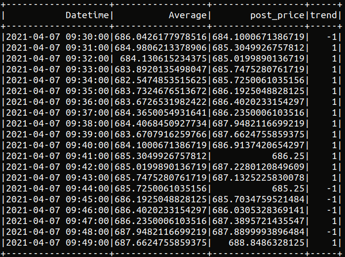

# stock-prediction

#### Scripts

All scripts should be running under >= Python 3.6.

- `twitter.sh`

  ```
  pip3 install progessbar
  chmod +x twitter.sh
  ./twitter.sh
  ```

  1. Use `progressbar` library to display scrip running progess.
  2. Set variable `iter` to adjust how many iterations to run.
  3. Set variable `runtime` to adjust how long to run in seconds for each iteration.
  4. Raw tweet jsons are stored in `data/tweetRaw/*`.
  5. Processed csv files are stored in `data/tweetParsed/*`.

  i.e If we fetch 6 hours of data, 30 min each set, then set in twitter.sh:

  ```
  let iter=12
  let runtime=1800
  ```

- `fetch_stream_tweets.py`

  ```
  pip3 install tweepy
  python3 scripts/fetch_stream_tweets [runtime in seconds] [output_path]
  ```

  uses `tweepy` library to extract streaming tweeter data for a certain period of time

- `read_stream_tweets.py`

  ```
  pip3 install textblob
  python3 scripts/read_stream_tweets [input_path] [output_path]
  ```

  uses `pandas` library to read and parse the tweeter data and outputs a csv file
  uses `textblob` library to access the sentiment score of tweet content

- `extract_stock.py`

  uses `yfinance` library to extract stock data for a certain company everyday from 2020-11-01 to 2020-12-01

  ```
  pip3 install yfinance
  ```

  - change `ticker_name` to desired company name in the script

  - change `interval` if you want to extract with different frequencies (ie, stock price change every minute/ hour/ etc.)

  - Run in main directory `/stock_prediction`, and output `stock_data.csv` file will be in `/data` folder

- `pandas_predict.py`

  - debug purpose, use it to test ml framework without pyspark

  - change absolute path to relative path accordingly

- `pyspark_predict.py`

  - change `global_setup` part to debug

- change absolute path to relative path accordingly
- `process_join_data.py`

  - process tweets and stock data, and join them to be outputted to `data/data_processed/` folder as a csv file
  - should be run in main directory

  note:

  - `window_size=10` : look at stock price changes 10 minutes after the tweet's create time
  - `trend`: 1 represents increasing, -1 represents decreasing, 0 otherwise

  > example of processed stock data:

  

- `pyspark_rf_train.py`

  - take input of `data/data_processed/*.csv` as training (and testing, for now) data
  - train 5 folds cv random forest model on numerical data
    - customize 1: change max_trees, max amount of random forests generated
    - customize 2: change maxDepth, max depth of each random forest
    - customize 3: change minInstancesPerNode, minimum distance of each subnode, currently calculated using Gini index
  - output to `data/data_prediction/`
  - run in main directory

  > note: change the `Trend` in `process_join_data.py` from -1 to 0 for the model to understand it is categorical

  > todo1: the indexes are messed up by cross-validation, need to fix it

  > todo2: need more data, current prediction is not useful since there is only one Trend
